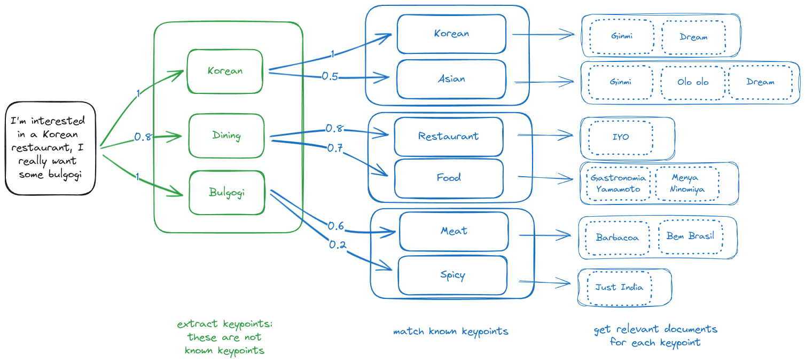

# Keyrag

## Installation

To install the package, run the following command:

```bash
poetry install
```

## Setup

To setup the package, create a `.env` file in `~/cred/keyrag/.env` with the following content:

```bash
KEYRAG_SAMPLE_ENV_VAR=sample
```

And for VSCode to recognize the environment file, add the following line to the
workspace [settings file](.vscode/settings.json):

```json
"python.envFile": "/home/pmn/cred/keyrag/.env"
```

Note that the path to the `.env` file should be absolute.

## Testing

To run the tests, use the following command:

```bash
poetry run pytest
```

or use the VSCode interface.

## IDEAs

Keypoint RAG engine.

Setup:

* Have a regular vector db.
* Compute Keypoints for each document.
* Embed the keypoints in a vector space.
* Save the mapping from document to keypoints -> will be distance scores.

RAG:

* Have a query
* Compute keypoints for the query
* Embed the keypoints in the vector space
* For each query keypoint find the closest keypoint(s) in the db
* Find the documents closest to the query keypoint(s)
* Aggregate the distances to get a score for the query



### Problem with similar keys

Say we have a korean restaurant, the keypoints are "korean", "diner"
Then we also have a korean bbq, the keypoints are "Korea", "bbq", "restaurant"
Then a third korean establishment, the keypoints are "South Korea", "dining"

Our query is "korean restaurant", the keypoints are "korean", "restaurant"
How do we decide the `k` for the number of closest keypoints to consider?

If it is 2, say we get:
* korean, Korea
* restaurant, dining

The second place has two matches, the first place has one match.
But it is silly to miss "diner" just because it is not in the top 2.

A reasonably high `k` would be better, but then we might get too many matches.
Also it does not scale as we keep adding more establishments, as we have no control over the number of different keypoint values.

When we add a new keypoint, we could check if it is similar to an existing keypoint.
The choice of the threshold for similarity is important.

### Derail

Steal the config style from recipamatic: https://github.com/Pitrified/recipamatic/blob/main/py/src/recipamatic/langchain_openai_/chat_openai_config.py

And the vector db from laife: https://github.com/Pitrified/laife/blob/main/src/laife/llm/vector_db.py

The config should have an abstract class that defines the interface.
The config should have a method that returns the embedding function (Embeddings).

Then steal the structured from recipamatic:
https://github.com/Pitrified/recipamatic/blob/main/py/src/recipamatic/cook/recipe_core/transcriber.py

And it would be so nice to have a Runnable? Chain? class that can be put in a standard langchain chain.
